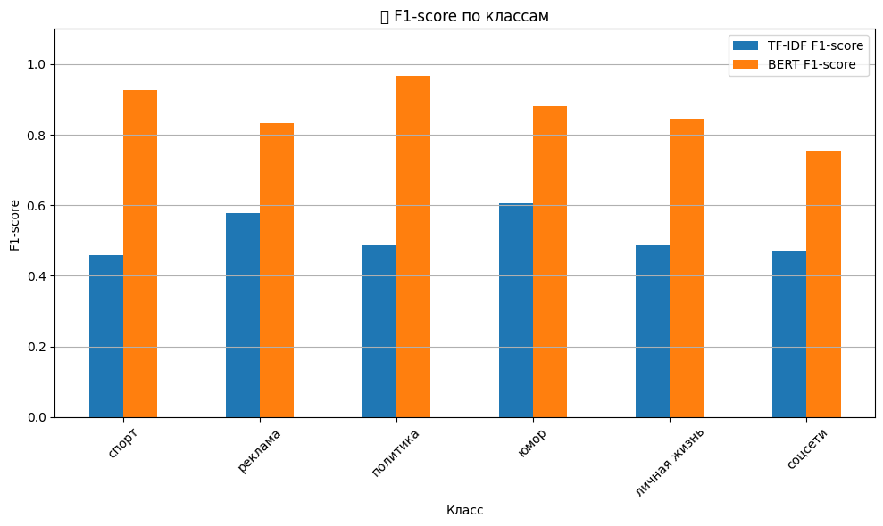
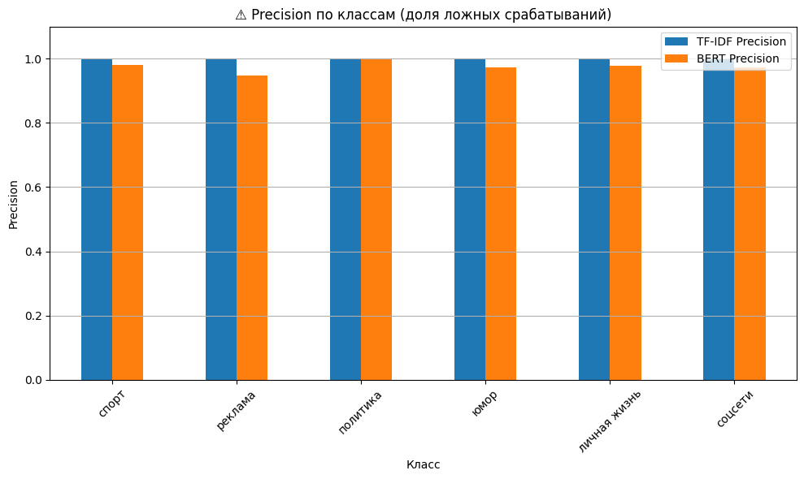
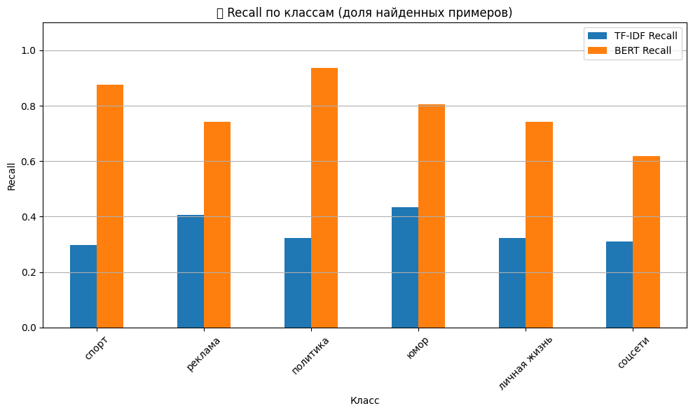
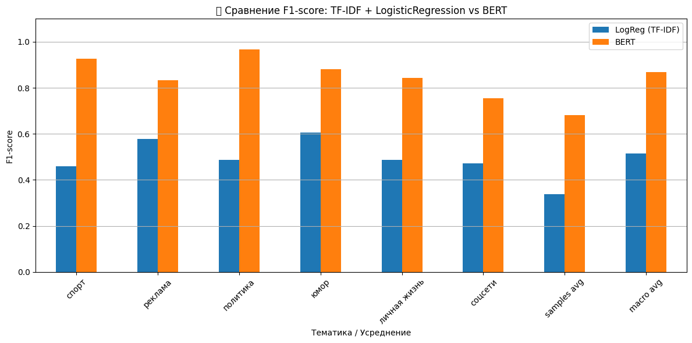
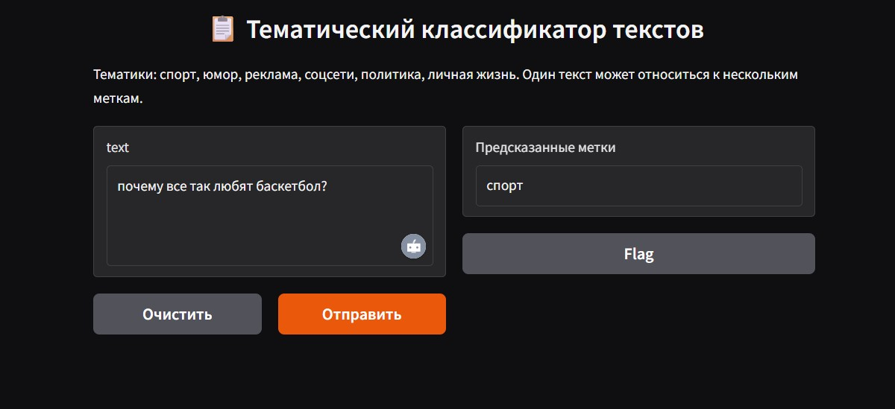

# MEPHI_Hackaton_2025

# Многоклассовая классификация текстов ( multilabel texts classification)
**Проект Хакатона МИФИ | Команда `Lab_Story`**

---

## 📌 Описание задачи

Разработать модель, которая определяет принадлежность коротких текстов (от 2 до 30 слов) к одной или нескольким тематикам из списка:

- 🏅 Спорт
- 📢 Реклама   
- 🏛 Политика
- 😄 Юмор  
- 💌 Личная жизнь
- 🌐 Соцсети 

Это задача **многоклассовой** и **мультилейбловой классификации**.

---

## 🗃️ Данные

- 📂 Исходные данные: 6 `.csv`-файлов с неразмеченными текстами (`doc_text`, `image2text`, `speech2text`).
- 📄 Отдельный `.doc`-файл с размеченными примерами. Сделали файл с 10 размеченными данными по файлу doc, затем по аналогии заполнили вручную и сделали датасет из 210 строк ( дополняя каждый класс вручную данными из интернета)
- 🤖 Данные из дополнительных столбцов (голос, изображение) объединены и вытянуты в 1 столбец.
- 📈 Объединенный столбец из 6 файлов - содержит Более **6000 строк** — неразмеченные данные, данные возможно использовать для масштабирования только частично ( каждый из 6 блоков был собран из различных ресурсов, в данных нет единообразия, классы собраны неравномерно - где-то их больше, где-то меньше)
- 🔧 В итоге создан размеченный датасет из **210 строк** (ручная разметка + эталонные примеры).
- 🔄 Добавлена **аугментация с синонимами** для увеличения выборки до 330 строк ( созданы примеры типовых фраз, автоматически в них проставлены слова-синонимы, в итоге созданы имитации отзывов по различным классам из исходного списка)

---

## 🧹 Предобработка

- Очистка данных от смайлов, HTML-тегов. Ссылки не удалялись, так как в них содержалась полезная информация - например smm - в названии сайта-ссылки указывает на класс "реклама".  
- Объединение всех текстовых полей в один столбец.  
- Приведение к **нижнему регистру**.  
- **Токенизация и лемматизация** (для TF-IDF модели).  
- **Сохранение оригинальной формы** (для BERT).

---

## 📌  Модели

- **TF-IDF + Logistic Regression** (`One-vs-Rest`)
- **RuBERT** (`DeepPavlov/rubert-base-cased`)

---

## 📊 Результаты

### 📌 Мини-датасет (210 строк)

| Метрика        | TF-IDF | RuBERT |
|----------------|--------|--------|
| F1 (samples)   | 0.059  | —      |
| F1 (weighted)  | 0.114  | —      |
| Recall (micro) | 0.068  | —      |

---

### 📌 Расширенный датасет (аугментированный)

| Класс          | Precision | Recall | F1   |
|----------------|-----------|--------|------|
| Спорт          | 1.0       | 0.30   | 0.46 |
| Реклама        | 1.0       | 0.41   | 0.58 |
| Политика       | 1.0       | 0.32   | 0.49 |
| Юмор           | 1.0       | 0.43   | 0.61 |
| Личная жизнь   | 1.0       | 0.32   | 0.49 |
| Соцсети        | 1.0       | 0.31   | 0.47 |
| **F1 (samples)** | —       | —      | **0.34** |

---

## 📈 Сравнение моделей по метрикам

Для оценки качества классификации были построены графики по основным метрикам: **F1-score**, **Precision** и **Recall** — для моделей TF-IDF + Logistic Regression и RuBERT.

---

### 🔹 F1-score по классам

Модель **RuBERT** демонстрирует существенно более высокие значения F1-score по всем классам по сравнению с TF-IDF, особенно по темам **"юмор"**, **"политика"**, **"личная жизнь"**. Это свидетельствует о лучшей сбалансированности между точностью и полнотой.

---

### ⚠️ Precision по классам (доля ложных срабатываний)

**TF-IDF** показывает завышенный уровень precision (близкий к 1.0), но это обусловлено тем, что модель делает крайне мало предсказаний. **RuBERT** работает активнее, предсказывает больше примеров, сохраняя при этом приемлемую точность.

---

### 🔍 Recall по классам (доля найденных примеров)

**RuBERT** значительно выигрывает по метрике recall: модель охватывает больше истинных примеров, особенно в сложных классах. У **TF-IDF** recall значительно ниже, что свидетельствует о слабой полноте предсказаний.

## 📊 Интегральное сравнение F1-score: TF-IDF vs BERT

На этом графике представлено сравнение значений **F1-score** по каждому классу и усреднённым метрикам для моделей:

- `LogReg (TF-IDF)`
- `BERT (DeepPavlov/rubert-base-cased)`

**Выводы:**
- BERT показывает более высокое качество классификации по всем классам.
- Особенно хорошо BERT работает по темам **"политика"**, **"юмор"** и при усреднении.
- Это делает BERT оптимальным выбором для мультилейбловой тематической классификации.

---

## 📌 Общий вывод:

- ✅ **RuBERT** — уверенный лидер по **F1** и **Recall**.
- ⚠️ **TF-IDF** — даёт высокий precision за счёт осторожности, но не справляется с редкими классами.
- 🎯 Выбор в пользу **RuBERT** обоснован в задачах, где важна полнота и более качественное покрытие классов.
  

  
  ### Запуск проекта

  * Код: Hackaton _2(1).ipynb
  * Датасеты: DataSet_1column_labeled(210).xlsx (созданный вручную датасет), augmented_dataset.xlsx ( датасет с аугментацией по синонимам)
  * Модель: bert_model.pkl   Векторизация: bert_vektorizer.pkl
  * Библиотека для UI: Gradio

